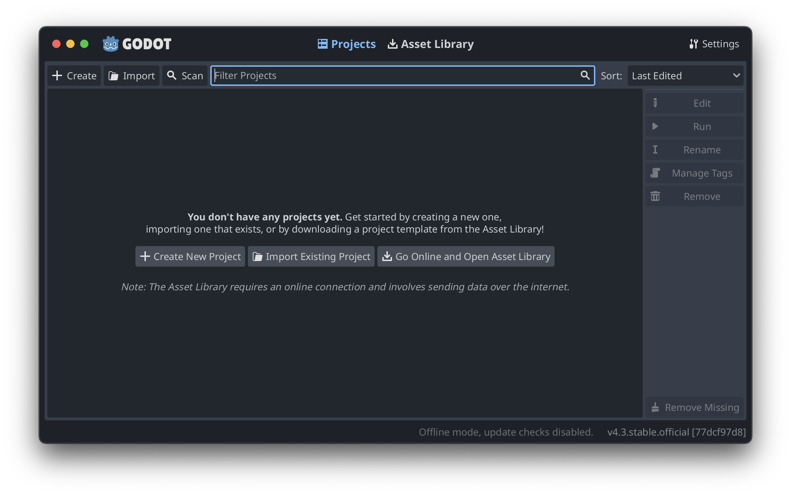
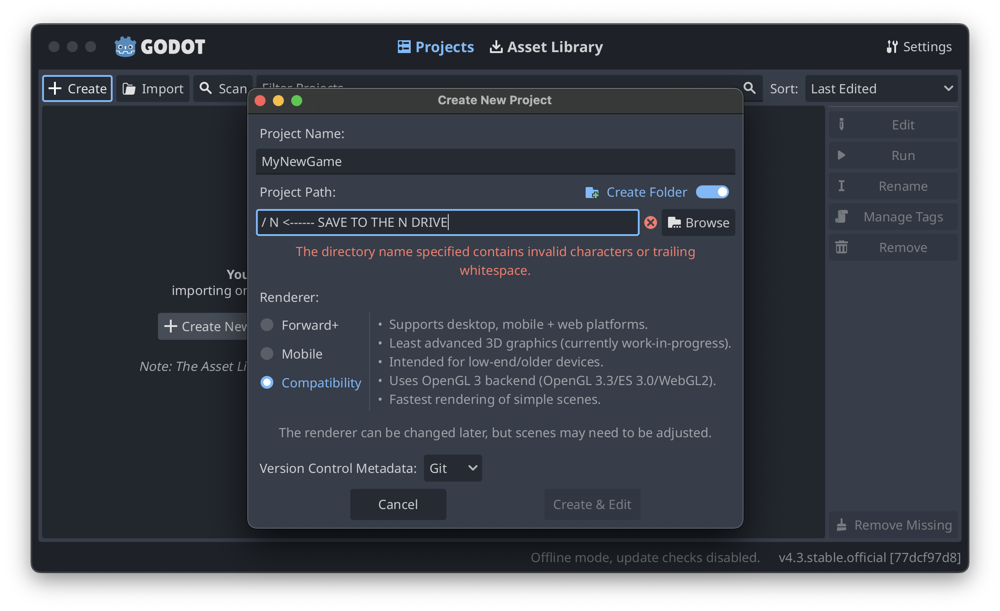
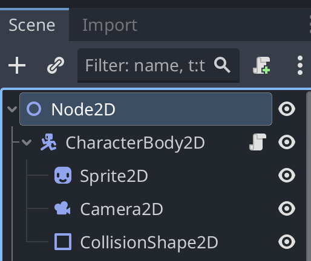
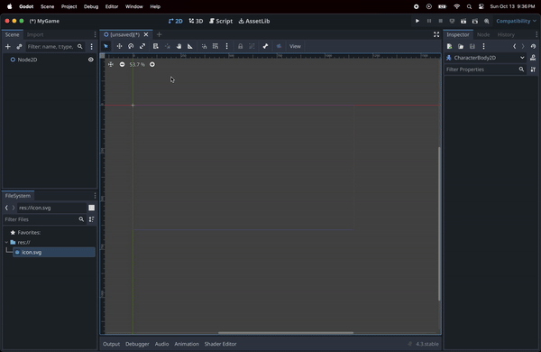
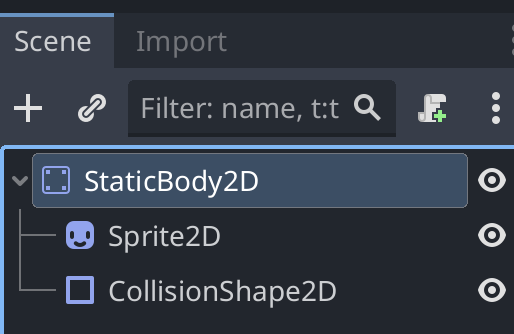
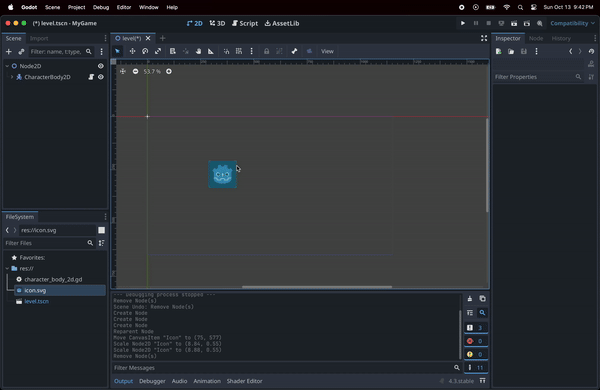
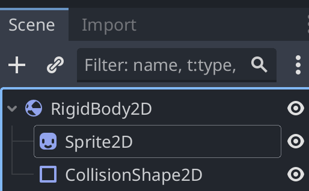
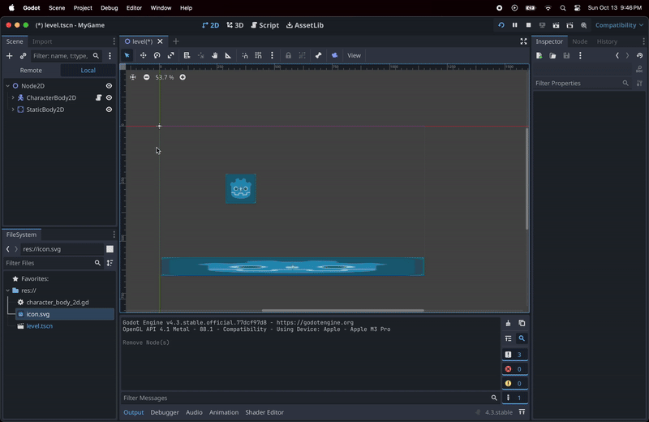
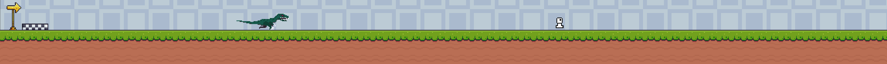

# GameDev

* [Overview](#overview)
* [Workshop Objectives](#workshop-objectives)
* [Quick Start](#quick-start)
* [Game Assets](#game-assets)
* [Tools & Resources](#tools--resources)
* [Video Demo](#video-demo)
* [Feedback](#feedback)

---

## Overview

 **Introduction to Game Development Workshop**
 
  This workshop is tailored for SBCC CS Club  who are eager to learn the fundamentals of game development.

## Workshop Objectives 🏗️

1. **Set up** a new project in Godot
2. **Create** a basic 2D game.

   - Creating 2D Scenes
   - Movable Player
   - Level
   - Static body 

3. **Feel confident** in your ability to explore and keep building.

## Quick Start 🚀

Quick start to create a new Godot project.

### Project Setup

   1. Lunch Godot

   2. Press create

   

   3. Name your game & save to N drive 

   

## 1. Godot Environment

   Select the 2D environment

   Create (+) a new Node2D

## 2. Creating a player 🕹️

   

   - **Node2D**⤵
      - Add a **CharacterBody2D**⤵
         - **Sprite2D** (Drag the Godot icon into the scene) 
          ***Note*** you might need to adjust the hierarchy. 
         - Add a **CollisionShape2D** and adjust the collision boundary to match the Sprite2D

   

---

## 3. Creating a platform

   

   - **Node2D**⤵
      - Add a **StaticBody2D**⤵
         - **Sprite2D** (Drag the Godot icon into the scene)
         - **CollisionShape2D** adjust the collision boundary

   

---

## 4. Reating a physics object (box)

   

   - **Node2D**⤵
      - Add a **StaticBody2D**⤵
         - **Sprite2D** (Drag the Godot icon into the scene)
         - **CollisionShape2D** adjust the collision boundary

   

---

## Tools & Resources

1. **Game Engine**: [Download Godot](https://godotengine.org/download)
2. **Tutorial Resources**:
   - [Official Godot Docs](https://docs.godotengine.org/en/stable/)
   - [Beginner's Game Development Guide](#)
3. **Sample Project**: [Link to GitHub Repository or another file-sharing platform](#).

## Game Assets

https://guttykreum.itch.io/orudo-taima

- **Free Game Design Libraries**:
   - [Kenney Assets](https://kenney.nl/assets)
   - [OpenGameArt](https://opengameart.org)

---

- **Demo Repos**:
   (Babbes AKA Own) https://github.com/Baboobraz/DontBugMe
   (God AKA Alfred Morgen)
   (OPEN) JAMES MAYBE

- **Starter Code**:
    - Prepare the **Godot** starter project with a basic menu and a start level for participants to build upon.

---
## Feedback

We value your feedback! After the workshop, please take a moment to fill out our [feedback form](#) to help us improve future events and workshops.

---

